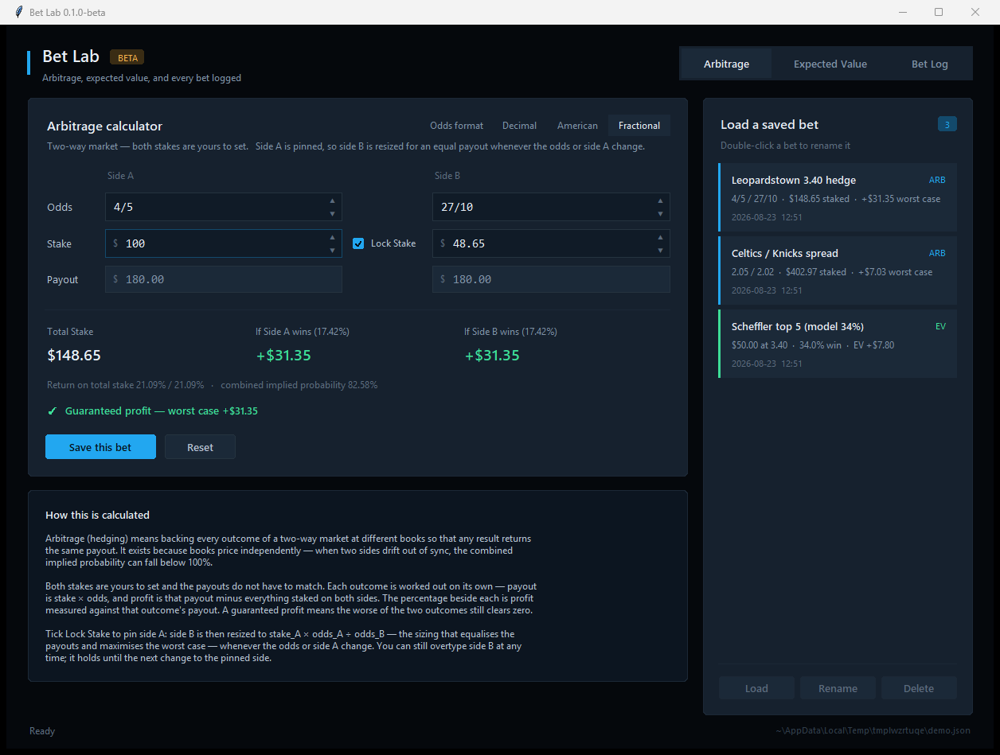
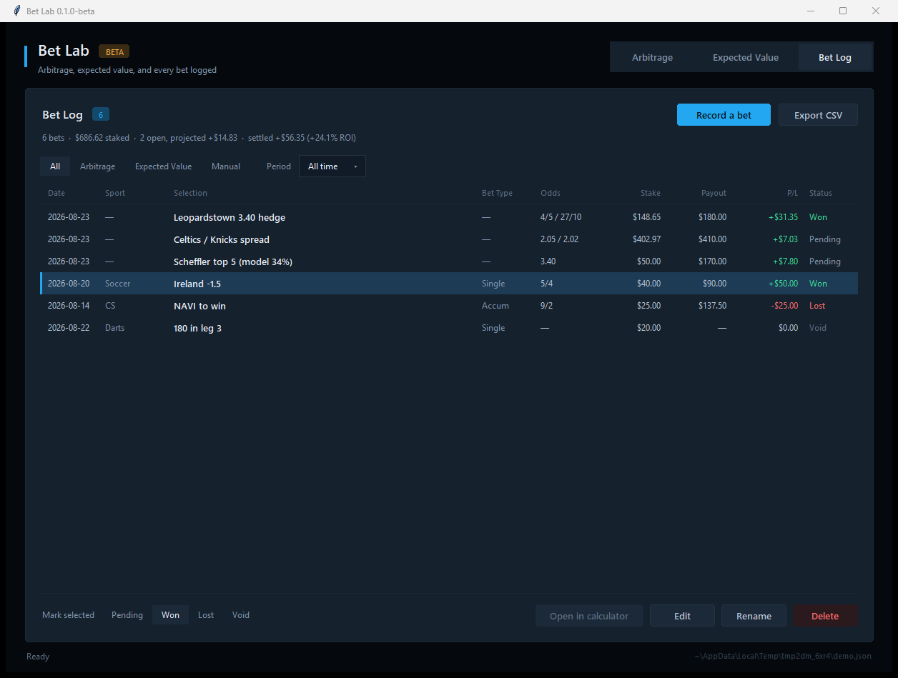

# Arb Calculator

**This is a beta.** Version 0.1.0-beta. It works and the maths is tested, but
it is still changing and there will be rough edges. Check any number against
your own before you stake money on it.

A small desktop app for two-way arbitrage, expected value, and keeping a log of
your bets. Python and tkinter, so there is nothing to install past Python
itself.



## What it does

Three tabs.

**Arbitrage** takes the odds and the stake on both sides of a two-way market.
Tick "Lock Stake" and side B is resized so that both outcomes pay out the same.
Leave it off and the stakes are whatever you type, with the profit reported
separately for each outcome. Odds can be decimal, American or fractional, and
switching format converts what is already on screen.

**Expected Value** does the usual sum: fair win probability times the profit if
it wins, minus the loss probability times the stake. Give it a no-vig
probability rather than the price the book is showing, otherwise you are only
measuring the vig.

**Bet Log** holds every calculation you have saved plus anything you type in by
hand. A hand-entered bet does not need two sides, odds or a payout. The
selection is the only required field.

You can tag a hand-entered bet with a sport (Soccer, GAA, Basketball, CS,
Valorant, Horse Racing, Greyhounds, Darts, Golf, MMA/Boxing, Other) and a type
(Single, Double, Treble, Accum, starting on Single). Both are optional, both
show in the log and both reach the CSV, so you can group a season by sport or
compare accumulators against singles.

A bet is identified by its selection, in the log and on the form. Earlier
versions asked for a name as well, which was the same thing said twice; bets
saved back then keep whichever label the log was already showing. Event,
Bookmaker and the Arbitrage / Expected Value / Manual kind are all still in the
CSV, and the filter row above the table narrows by kind.

Mark a bet Pending, Won, Lost or Void and the P/L column follows. A loss costs
you the stake, a void is a wash at zero, and a winner shows the payout less the
stake. While a bet is still pending the column shows what it stands to make
instead. The period dropdown narrows the log to today, the last 7 or 30 days,
this month or this year, and the summary line above it re-totals to match, so
you can see what you actually made over a stretch rather than only in total.

The whole thing exports to CSV.



## Running it

You need Python 3.9 or newer. Tkinter comes with the standard Windows and macOS
installers. On Linux it is usually a separate package, `python3-tk` on Debian
and Ubuntu.

Get the code, either by cloning:

```
git clone https://github.com/mccoolsa/arb-calculator
cd arb-calculator
```

or with the green **Code** button at the top of this page, **Download ZIP**,
then unzip it.

Then run:

```
python app.py
```

On Windows you can double-click `run.bat` instead.

## Where your bets are saved

In `saved_bets.json`, beside `app.py`. Plain JSON, easy to read, and listed in
`.gitignore` so it never gets committed. Delete it if you want to start again.

The CSV export writes numbers as plain numbers, with no currency symbols or
thousands separators, so Excel and Power BI read them as numbers rather than
text. It keeps `Projected P/L` and `Realised P/L` in separate columns, so a
bet that has not settled yet does not look like a result.

## The maths

Arbitrage, using decimal odds:

```
payout      = stake x odds             (each side)
profit      = payout - total staked    (each side)
hedge stake = stake_A x odds_A / odds_B
```

The percentage beside each outcome is that outcome's profit over its own
payout. Odds of 1.80 and 3.70 with 100 on the first side gives 48.65 on the
second, 180.00 back either way, 148.65 staked and 31.35 profit, which is
17.42 percent.

Expected value:

```
EV = p x (stake x (odds - 1)) - (1 - p) x stake
```

100 at +110 with a fair 50 percent chance gives 0.50 x 110 - 0.50 x 100 = 5.00.

## Tests

```
python tests/test_core.py
python tests/test_betlog.py
```

Both run on their own, or under pytest if you have it.

## Known limitations

* Two-way markets only. No three-way or draw handling yet.
* No live odds. Everything is typed in.
* No currency conversion. The dollar sign is only a label.
* Only tested on Windows.

## Licence

MIT, see [LICENSE](LICENSE).
