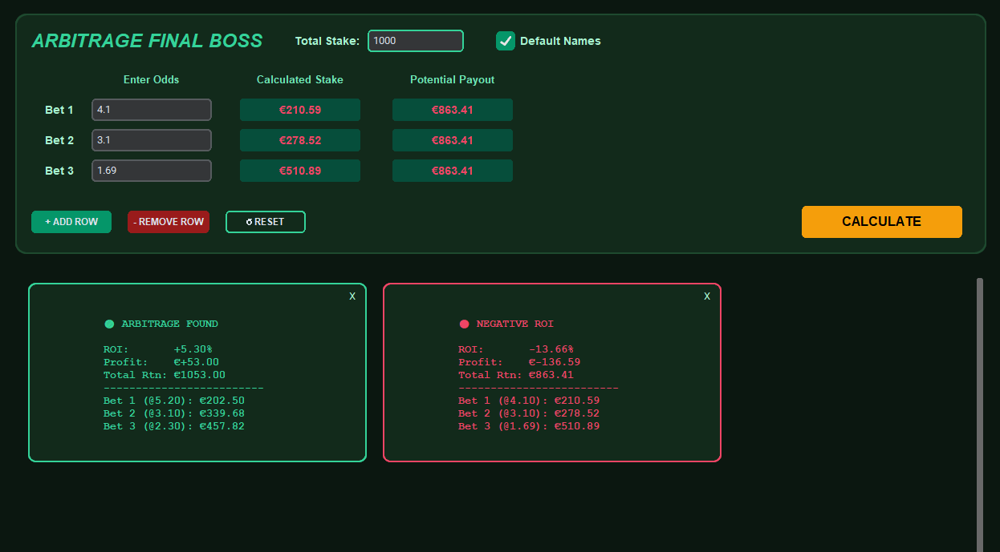

# 🟢 Arbitrage Final Boss

Arbitrage Betting Calculator built with Python. It allows users to quickly calculate required stakes and potential payouts across dynamic markets to guarantee a positive ROI.



## ✨ Features

* **Dynamic Betting Rows:** Add or remove as many betting legs as you need to handle complex, multi-way arbitrage opportunities.
* **Smart Input Parsing:** Automatically converts fractional odds (e.g., `5/2`) into decimals on the fly.
* **Auto-Calculations:** Instantly distributes your total stake proportionally across all bets to guarantee an equal payout.
* **Visual ROI Indicators:** Highlights profitable arbitrage opportunities in green and negative ROI scenarios in red.
* **Session Memory & Export:** Generates an ongoing dashboard of your calculations. Upon closing the app, it prompts you to seamlessly export all active data to a cleanly formatted `.csv` file.
* **Dark Mode UI:** A custom, low-eye-strain interface built with a deep green aesthetic.

## 🛠️ Prerequisites

If you want to run the code from source, you will need Python installed along with the `customtkinter` library.

```bash
pip install customtkinter